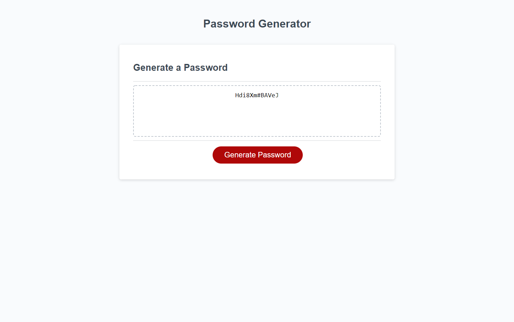

# 03 JavaScript: Password Generator
This homework assignment was about how to make an website that can generate a password. A password generator website showcases my basic skills and talents of the HTML and CSS skills that i learned in class.

## Given Task

This week’s homework required us to modify the starter code to create an application that enables employees to generate random passwords based on criteria that they’ve selected. This app will run in the browser and will feature dynamically updated HTML and CSS powered by JavaScript code that i write. It will have a clean and polished, responsive user interface that adapts to multiple screen sizes.

## Given User Story

```
AS AN employee with access to sensitive data
I WANT to randomly generate a password that meets certain criteria
SO THAT I can create a strong password that provides greater security
```

## Completed Acceptance Criteria

```
WHEN clicked the button to generate a password
-GIVEN option of a new, secure password.
WHEN prompted for password criteria
-GIVEN a series of prompts for password criteria.
WHEN prompted for the length of the password
-GIVEN which criteria to include in the password.
WHEN asked for character types to include in the password
-GIVEN an Alert to choose a length of at least 8 characters and no more than 128 characters.
WHEN I answer each prompt
-GIVEN an option to confirm whether or not to include lowercase, uppercase, numeric, and/or special characters.
WHEN all prompts are answered
-GIVEN the password is generated and the password is either displayed in an alert or written to the page.
```

## Mock-Up

The following image shows the web application's appearance and functionality:



# Git Hub:
*My project was pushed to GitHub at the following repository:https://github.com/syke2good/Password-Generator

*You can access the deployed application with the GitHup Pages link:https://syke2good.github.io/Password-Generator/

# License
License Copyright (c) 2012-2021 Scott Chacon and others
Permission is hereby granted, free of charge, to any person obtaining a copy of this software and associated documentation files (the "Software"), to deal in the Software without restriction, including without limitation the rights to use, copy, modify, merge, publish, distribute, sublicense, and/or sell copies of the Software, and to permit persons to whom the Software is furnished to do so, subject to the following conditions:

The above copyright notice and this permission notice shall be included in all copies or substantial portions of the Software.

THE SOFTWARE IS PROVIDED "AS IS", WITHOUT WARRANTY OF ANY KIND, EXPRESS OR IMPLIED, INCLUDING BUT NOT LIMITED TO THE WARRANTIES OF MERCHANTABILITY, FITNESS FOR A PARTICULAR PURPOSE AND NONINFRINGEMENT. IN NO EVENT SHALL THE AUTHORS OR COPYRIGHT HOLDERS BE LIABLE FOR ANY CLAIM, DAMAGES OR OTHER LIABILITY, WHETHER IN AN ACTION OF CONTRACT, TORT OR OTHERWISE, ARISING FROM, OUT OF OR IN CONNECTION WITH THE SOFTWARE OR THE USE OR OTHER DEALINGS IN THE SOFTWARE.

